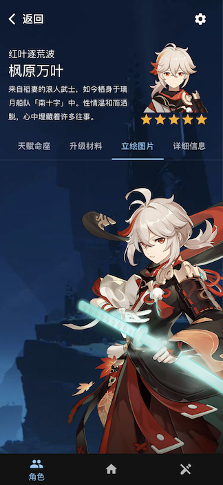
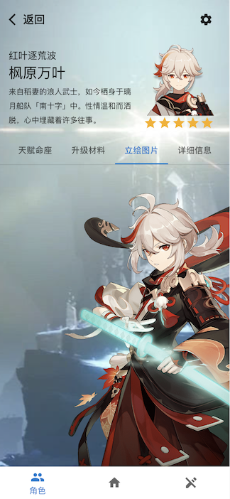

# Genshin Detail Mobile Web App

## Tech Stacks

- [React]() v18+
- [Vite]() v3+
- [TypeScript]() v4.6+
- [Material UI]() v5+
- [Sass]()
- [React Query]() v3+

## Folders

```js
|- docs  // github page
|- src
    |- assets
    |- components
        |- Common
        |- Layout
        |- Routes // route views
        |- ReactQueryClient  // query client Provider
        |- Themes  // material ui theme Provider
    |- hooks
    |- styles
    |- App.tsx
    |- main.tsx
|- index.html
|- package.json
|- ...
```

## Images




